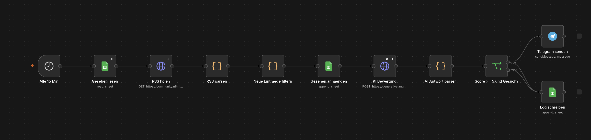

# n8n Forum Monitor

Ein n8n-Workflow, der das n8n-Community-Forum (Kategorie Jobs) alle 15 Minuten prüft,
neue Posts per KI bewertet und mich bei passenden Gesuchen per Telegram benachrichtigt.
Läuft produktiv auf n8n Cloud.

## Was er macht
1. Holt alle 15 Minuten den RSS-Feed der Jobs-Kategorie
2. Filtert Posts heraus, die schon bekannt sind (Google Sheets)
3. Lässt Google Gemini jeden neuen Post bewerten: Ist es ein Gesuch? Welche Sprache, welcher Umfang, Score 1-10
4. Schickt bei Score 5 oder höher eine Telegram-Nachricht mit Zusammenfassung und Link
5. Protokolliert jeden bewerteten Post in einem Google Sheet

## Eingesetzt
n8n Cloud, Google Sheets, Google Gemini API, Telegram Bot API

## Über mich
Benjamin Mossier, Web Base Solution, Mespelbrunn.
Ich baue n8n-Automationen und Websites, KI-gestützt, und teste jeden Schritt selbst.

---

*English: n8n workflow that polls the n8n community job forum every 15 minutes, scores new posts
with an LLM, and sends matching ones to Telegram. Running in production on n8n Cloud.*
